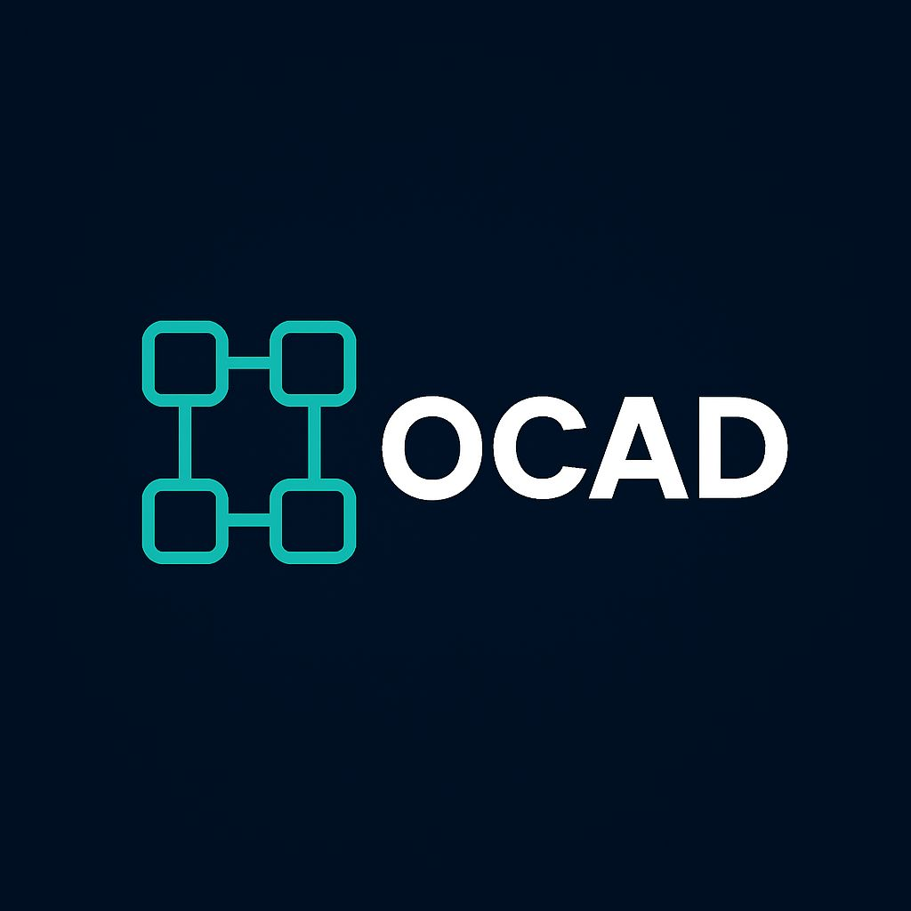
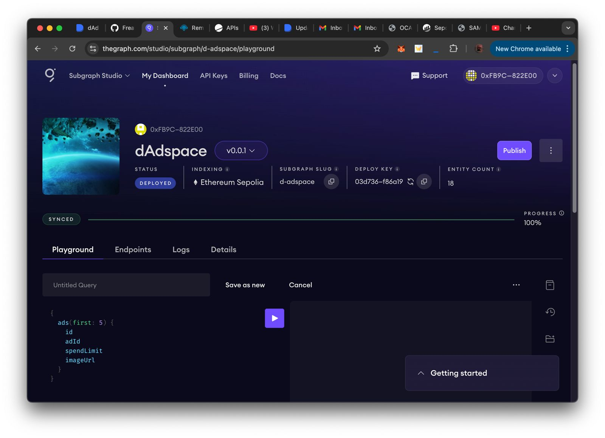
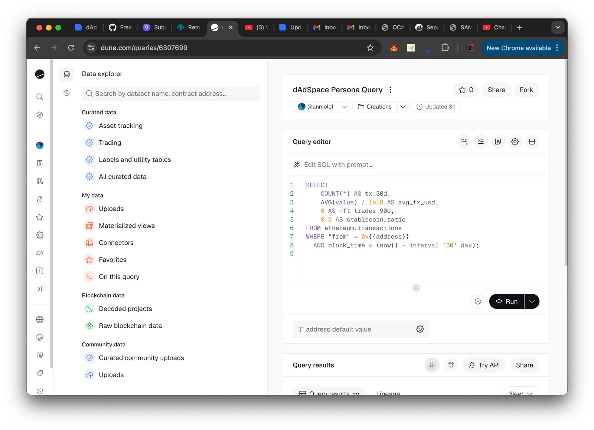
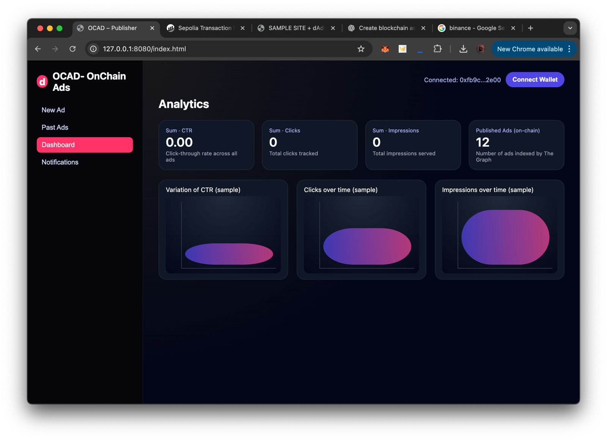
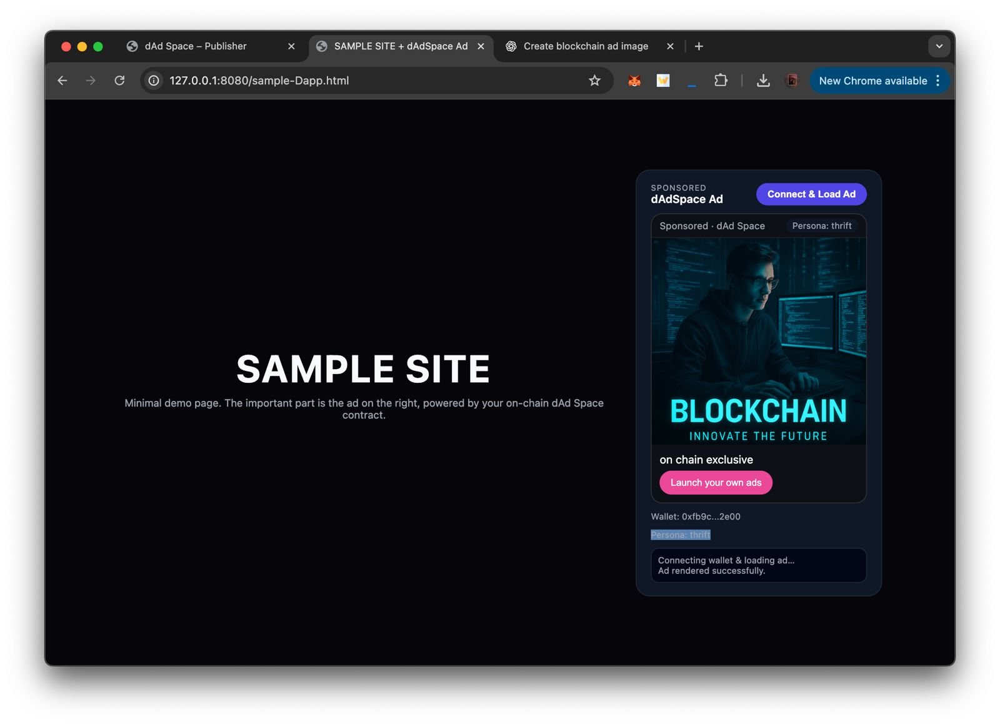

  

# Overview

Most Web3 projects still monetize like Web2 – with centralized ad networks, cookies, and opaque tracking.

OCAD (Onchain Ads) is a decentralized ad layer for Web3:

- Segments users based on _on-chain behavior_
- Lets _publishers_ monetize DApps via ad slots
- Lets _advertisers_ target the right Web3 users
- Uses _smart contracts + subgraphs_ for transparent, verifiable metrics

# Key Features

- Wallet-based user segmentation

  - Beginner (new wallets / low activity)
  - NFT users (wallets holding NFTs)
  - DeFi users (wallets holding DeFi tokens)
  - _(segments are extensible)_

- Privacy-friendly targeting

  - No cookies
  - No email IDs or Web2 identifiers
  - Purely on-chain signals

- Publisher ad slots

  - Simple JS SDK to plug ads into any DApp/website
  - Ad selection handled automatically based on user segment

- Advertiser campaigns

  - Create a campaign with:
    - Ad creative (image / URL)
    - Target segment(s)
    - Budget
  - Spend and performance are transparent

- On-chain analytics foundation
  - Views / clicks designed to be tracked via smart contracts + subgraph
  - Easy to extend into dashboards later

Dune:
The whole ad world depends upon the user persona. Target audience is one of the biggest factors for a successful ad campaign. So using Dune we are accessing all the previous transactions and address holdings. We have built SDK over the dune to get address id and fetch data and accordingly we run queries and using them we return the user persona. Over that user persona, all the ads are fetched and it gets to the user. So Dune is acting like a data partner and we are accessing it with our own SDK

The Graph:
Our concept requires a lot of data, thus every time a user connects, we must fetch data. So it can be quite inundated to fetch directly from chains. Since the subgraph indexes the data, it facilitates our work and enables us to retrieve accurate data at a remarkable rate.

# Tech Stack

Frontend: HTML, CSS, JavaScript, TypeScript
Smart Contracts: Solidity (Polygon)
Backend: Node.js, Express, PostgreSQL
Indexing & Analytics: The Graph, GraphQL, Dune
Notifications: Push Protocol
Tools: Git, GitHub, VS Code

# High-Level Architecture

User Wallet
↓
Onchain Data (NFTs, tokens, activity)
↓
Segmentation Logic (in SDK + contracts)
↓
Ad Matching (smart contract + subgraph)
↓
Ad Served in Publisher’s DApp
↓
Events Logged (views / clicks) → On-chain + subgraph
↓
Revenue Split (Advertiser → Publisher)

Demo video: https://youtu.be/_dGfkDchhls
Network: Sepolia Testnet (MetaMask)

